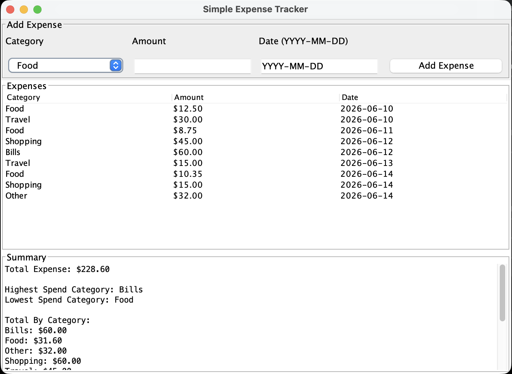

# Simple Expense Tracker

This is a basic Java desktop application for tracking expenses. The user can enter a category, amount, and date for each expense. The app stores the data in a CSV file and shows a summary of the expenses.

## Features

- Add an expense with category, amount, and date
- View all expenses in a table
- See total expense
- See total expense by category
- See expense trend by date
- See highest and lowest spend category
- Save data in `expenses.csv`

## Application Screenshot



## Files

- `Expense.java` - stores the data for one expense
- `ExpenseManager.java` - handles the main calculations
- `FileHandler.java` - reads from and writes to the CSV file
- `ExpenseTrackerApp.java` - contains the Swing user interface
- `expenses.csv` - seed data and saved expenses
- `PRESENTATION.md` - short presentation explaining the project

## How to Run

Open a terminal in this folder and run:

```bash
javac Expense.java FileHandler.java ExpenseManager.java ExpenseTrackerApp.java
java ExpenseTrackerApp
```

## How to Test

1. Run the application.
2. Add a new expense using the form.
3. Check that the expense appears in the table.
4. Check that the total, category totals, trend, highest category, and lowest category update.
5. Close and reopen the app to confirm the data is saved in `expenses.csv`.

## Design Notes

I used CSV file storage because the project requirements said a database was not necessary. I used Java Swing because it allowed me to create a simple UI without adding extra frameworks or setup.
